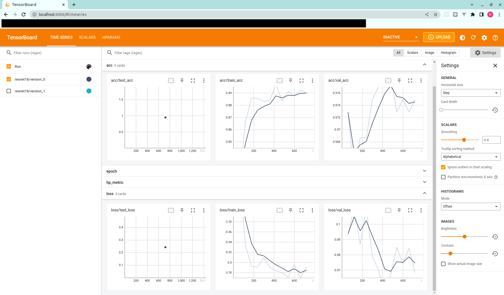

## 環境構築

1. `docker build -t <任意のタグ名> .`でイメージをビルドする(ex. `docker build -t dog-vs-cat-vs-rabbit .`)

## 実行方法

1. `docker run -v <本ディレクトリへのパス>:/work -it --rm <任意のタグ名> python main.py`を実行する。

   gpu を使用する場合は、下記を実行する。

   ```
   docker run --gpus all --privileged --rm -it -v <本ディレクトリへのパス>:/work <任意のタグ名> python main.py
   ```

2. `./data`が以下の構成であること

```
./data
|_先端課題023
    |-TEST: テストデータディレクトリ
    |   |-xxxx.jpg
    |   :
    |   |_annotation.csv: テストデータのアノテーションデータ
    |_TRAIN: 学習データディレクトリ
        |-Dog: 学習用犬の画像一覧
        |-Cat: 学習用猫の画像一覧
        |_Rabbit: 学習用うさぎの画像一覧
```

## TensorBoard によるログ確認

1. `docker run --rm -it -p 6006:6006 -v <本ディレクトリへのパス>:/work dog-vs-cat-vs-rabbit tensorboard --logdir ./dst --bind_all`

2. ブラウザで `http://localhost:6006/` にアクセスする。

3. ブラウザにて、下記の指標を確認することができる。

- train, valid, test での loss

- train, valid, test での accuracy

  

## 使用モデル, フレームワーク

- フレームワーク

  - pytorch_lightning

- 使用モデル

  - resNet18
